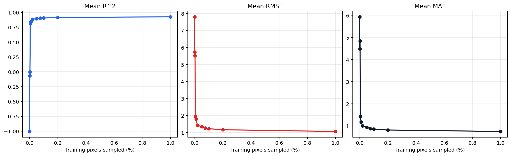
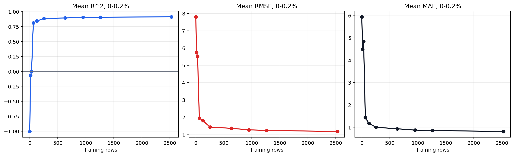
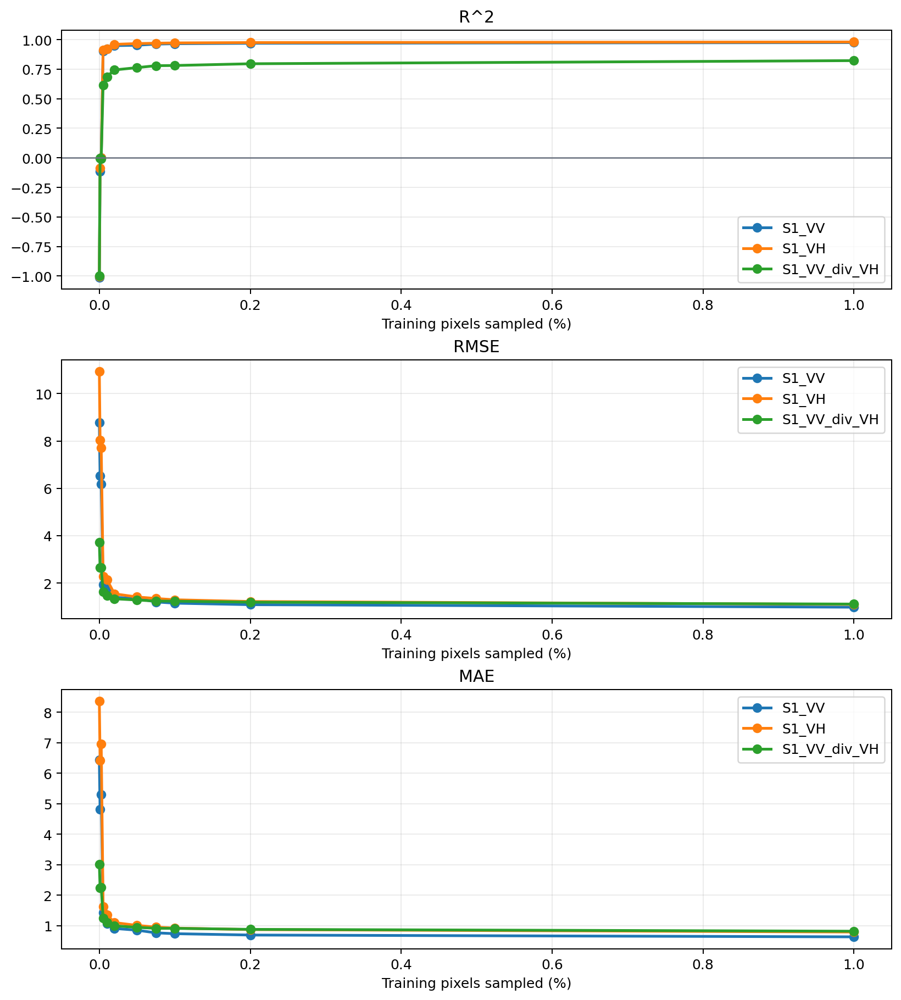

# Single-Image SAR Training Sample Sweep

## Objective

This experiment tests how AlphaEarth-to-Sentinel-1 SAR prediction quality changes as more valid image pixels are used for supervised training.

Unlike the reconstruction report, this run does not write a reconstructed SAR image. It only trains models and evaluates R^2, RMSE, and MAE on one fixed validation set.

## Setup

- Input stack: `/Users/cassius/Github-workspace/alphaearth-to-sar-cross-model-prediction/DataSources/single_image_sar_reconstruction/sentinel1_alphaearth_small_stack_sf_downtown_golden_gate_2024.tif`
- Valid pixels: `1265192`
- Validation fraction: `0.200`
- Validation rows: `253038`
- Candidate training pool rows: `1012154`
- Predictors: `A00` to `A63`
- Targets: `S1_VV`, `S1_VH`, `S1_VV_div_VH`
- Model for nonzero sample rates: `MultiOutputRegressor(LGBMRegressor)`

The `0.0%` row is a no-training random baseline. It predicts each validation pixel by drawing random SAR values from the non-validation pool, so it measures chance-level performance rather than a learned AlphaEarth-to-SAR mapping.

## Mean Metrics Across SAR Bands

| Sample % | Train rows | Mean R^2 | Mean RMSE | Mean MAE |
|---:|---:|---:|---:|---:|
| 0 | 0 | -1.005 | 7.8075 | 5.9356 |
| 0.001 | 13 | -0.068 | 5.7368 | 4.4883 |
| 0.0025 | 32 | -0.002 | 5.5157 | 4.8369 |
| 0.005 | 63 | 0.810 | 1.9505 | 1.4321 |
| 0.01 | 127 | 0.843 | 1.7930 | 1.1783 |
| 0.02 | 253 | 0.884 | 1.4253 | 1.0019 |
| 0.05 | 633 | 0.894 | 1.3489 | 0.9347 |
| 0.075 | 949 | 0.904 | 1.2635 | 0.8765 |
| 0.1 | 1265 | 0.906 | 1.2267 | 0.8561 |
| 0.2 | 2530 | 0.913 | 1.1670 | 0.8143 |
| 1.0 | 12652 | 0.926 | 1.0646 | 0.7478 |

{ width=100% }

## Low-Rate Detail

The largest mean R^2 jump in this run occurs between `0%` (0 rows) and `0.001%` (13 rows): mean R^2 increases by `0.937`.

Among learned models only, the sharpest increase occurs between `0.0025%` (32 rows) and `0.005%` (63 rows): mean R^2 increases by `0.812`.

{ width=100% }

## Metrics By SAR Band

| Sample % | Train rows | Band | R^2 | RMSE | MAE |
|---:|---:|---|---:|---:|---:|
| 0 | 0 | `S1_VV` | -1.012 | 8.7681 | 6.4371 |
| 0 | 0 | `S1_VH` | -1.004 | 10.9248 | 8.3526 |
| 0 | 0 | `S1_VV_div_VH` | -0.998 | 3.7297 | 3.0171 |
| 0.001 | 13 | `S1_VV` | -0.115 | 6.5257 | 4.8038 |
| 0.001 | 13 | `S1_VH` | -0.086 | 8.0410 | 6.4175 |
| 0.001 | 13 | `S1_VV_div_VH` | -0.004 | 2.6437 | 2.2434 |
| 0.0025 | 32 | `S1_VV` | -0.000 | 6.1811 | 5.3009 |
| 0.0025 | 32 | `S1_VH` | -0.001 | 7.7190 | 6.9483 |
| 0.0025 | 32 | `S1_VV_div_VH` | -0.007 | 2.6471 | 2.2616 |
| 0.005 | 63 | `S1_VV` | 0.902 | 1.9344 | 1.4201 |
| 0.005 | 63 | `S1_VH` | 0.913 | 2.2808 | 1.6264 |
| 0.005 | 63 | `S1_VV_div_VH` | 0.615 | 1.6363 | 1.2499 |
| 0.01 | 127 | `S1_VV` | 0.920 | 1.7479 | 1.0671 |
| 0.01 | 127 | `S1_VH` | 0.922 | 2.1521 | 1.3584 |
| 0.01 | 127 | `S1_VV_div_VH` | 0.686 | 1.4788 | 1.1094 |
| 0.02 | 253 | `S1_VV` | 0.949 | 1.3944 | 0.9087 |
| 0.02 | 253 | `S1_VH` | 0.960 | 1.5454 | 1.1017 |
| 0.02 | 253 | `S1_VV_div_VH` | 0.744 | 1.3361 | 0.9953 |
| 0.05 | 633 | `S1_VV` | 0.952 | 1.3494 | 0.8518 |
| 0.05 | 633 | `S1_VH` | 0.966 | 1.4124 | 1.0079 |
| 0.05 | 633 | `S1_VV_div_VH` | 0.763 | 1.2850 | 0.9442 |
| 0.075 | 949 | `S1_VV` | 0.962 | 1.2031 | 0.7643 |
| 0.075 | 949 | `S1_VH` | 0.969 | 1.3482 | 0.9523 |
| 0.075 | 949 | `S1_VV_div_VH` | 0.779 | 1.2393 | 0.9129 |
| 0.1 | 1265 | `S1_VV` | 0.965 | 1.1510 | 0.7370 |
| 0.1 | 1265 | `S1_VH` | 0.972 | 1.2941 | 0.9196 |
| 0.1 | 1265 | `S1_VV_div_VH` | 0.781 | 1.2350 | 0.9117 |
| 0.2 | 2530 | `S1_VV` | 0.969 | 1.0876 | 0.6926 |
| 0.2 | 2530 | `S1_VH` | 0.975 | 1.2208 | 0.8717 |
| 0.2 | 2530 | `S1_VV_div_VH` | 0.796 | 1.1926 | 0.8786 |
| 1.0 | 12652 | `S1_VV` | 0.975 | 0.9815 | 0.6331 |
| 1.0 | 12652 | `S1_VH` | 0.980 | 1.0998 | 0.7920 |
| 1.0 | 12652 | `S1_VV_div_VH` | 0.822 | 1.1126 | 0.8182 |

{ width=90% }

## Interpretation

R^2 should increase and RMSE/MAE should decrease as training pixels are added if the embeddings contain predictive SAR information. The random baseline is expected to have strongly negative R^2 because it draws unrelated SAR values from the scene distribution instead of using AlphaEarth features.
